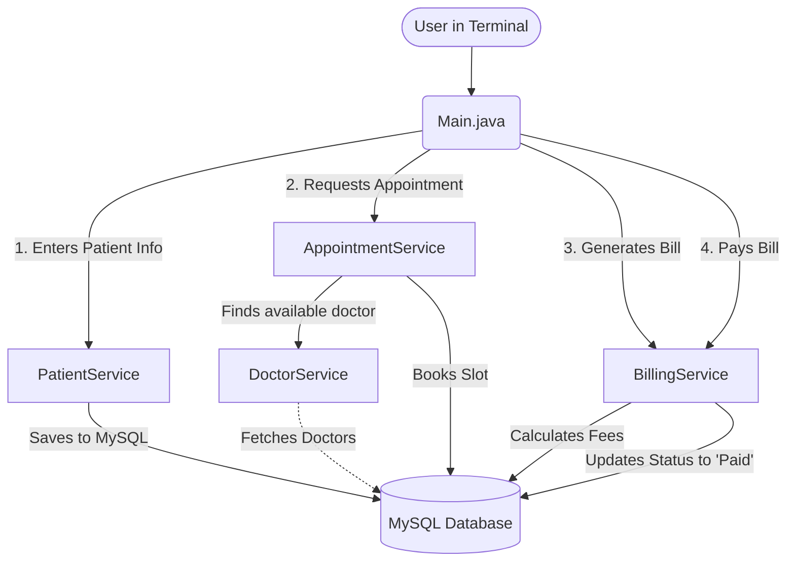

# 🏥 Hospital Management System

Welcome to the **Hospital Management System**! This is a simple, easy-to-read Java console application that helps manage a hospital's daily tasks. It uses a **MySQL Database** to securely save all your data, so you never lose your history even after you close the app!

---

## ✨ What Can This App Do?

This system automates the most important hospital tasks:
1. **Registers Patients:** Safely stores patient details, ages, and their current symptoms.
2. **Smart Doctor Matching:** If you type a symptom like "foot pain", the system automatically finds the Orthopedic doctor and books the next available time slot!
3. **Generates Bills:** Creates a final receipt combining consultation and service fees.
4. **Processes Payments:** Directly asks the user if they want to pay the bill right now and instantly updates the database status to 'Paid'.

---

## 🛠️ How It Works (Project Flow)

Here is a visual flow diagram showing how the different parts of the application talk to each other and the database:



---

## 🚀 How to Run the App

Because this app uses a real database, you just need to make sure MySQL is running on your computer. (The app automatically creates the database and all the tables for you on startup!)

**Step 1: Get the MySQL Driver**
Make sure you have the `mysql-connector.jar` file in your project folder (which acts as a bridge between Java and MySQL).

**Step 2: Compile the Code**  
Open your terminal (PowerShell or Command Prompt) in the project folder and compile all the files:
```powershell
javac Main.java model/*.java service/*.java utils/*.java
```

**Step 3: Run the App**  
Start the program by running this command in your terminal so Java knows to use the MySQL bridge:
```powershell
java -cp ".;mysql-connector.jar" Main
```

*(If you are on a Mac/Linux machine, use `:` instead of `;` in the quotes).*

---

## 💻 Example of What You'll See

Here is exactly what the app looks like when you run it in your terminal:

```text
=== Hospital Management System ===
Enter Patient Name: Satyam
Enter Age: 21
Enter Symptom (e.g., foot pain, heart, kids): foot pain

[✔] Appointment Booked!
Doctor: Dr. Smith (Orthopedic)
Slot: 10:00 AM

--- Bill Generated ---
Total Amount: $550.0
Status: Pending

Do you want to pay the bill now? (yes/no): yes
[💰] Payment Successful for Bill ID: 52a12b7a-9c2b...

Thank you for using the Hospital Management System.
```
