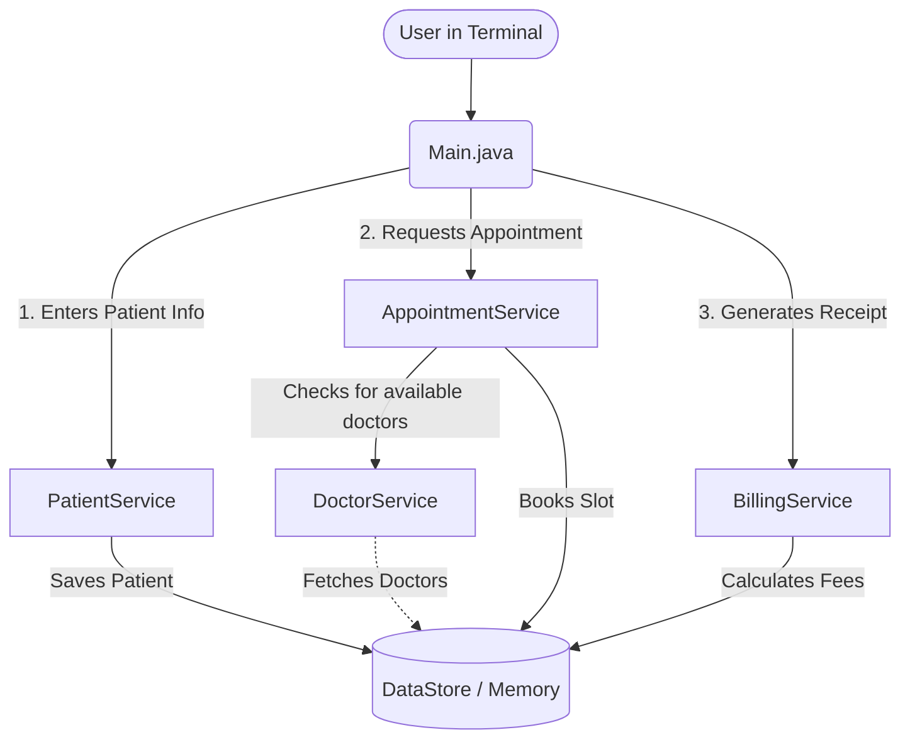

# Hospital Management System 🏥

Welcome to the **Hospital Management System**! This is a straightforward, beginner-friendly Java application that runs right in your terminal. It helps manage the basic day-to-day operations of a hospital without needing any complicated database setup or external installations. 

Everything runs in-memory, meaning all the data is saved temporarily while the application is running, making it super easy to test and use!

---

## 🛠️ How It Works (Project Flow)

Here is a simple flow diagram showing how the different parts of the application work together:



---

## 📂 What's Inside? (Folder Structure)

Here's how the code is organized:

* **`model/`**: This folder contains the blueprints for our real-world objects.
  * `Patient.java` - Holds patient details (Name, Age, Symptoms).
  * `Doctor.java` - Holds doctor details (Name, Specialty, Available Time Slots).
  * `Appointment.java` - Links a patient to a doctor at a specific time.
  * `Bill.java` - Stores the final billing amounts.
* **`service/`**: This folder contains the "brains" of the operation.
  * `PatientService.java` - Handles registering new patients.
  * `DoctorService.java` - Finds the right doctor based on the patient's symptoms.
  * `AppointmentService.java` - Books the actual time slot.
  * `BillingService.java` - Calculates the consultation fees and service charges.
* **`utils/DataStore.java`**: This acts as our "Database". It uses simple Java Lists (`ArrayList`) to hold all our patients and doctors while the app is running.
* **`Main.java`**: The starting point of our application where the user types in their inputs.

---

## 🚀 How to Run the App

Because we removed all the complicated database requirements, running this is as easy as running any standard Java file.

**Step 1: Compile the Code**  
Open your terminal (in the project folder) and tell Java to compile all the files:
```powershell
javac Main.java model/*.java service/*.java utils/*.java
```

**Step 2: Run the App**  
Start the program by running:
```powershell
java Main
```

*(If you are using an IDE like VS Code, you can also just click the "Run" button on `Main.java`!)*

---

## ✨ Features You Can Try
- **Smart Doctor Match:** If you type "foot pain" as your symptom, the system is smart enough to find the Orthopedic doctor automatically!
- **Automatic Billing:** The system automatically charges a standard consultation fee and service fee.
- **Easy to Read Code:** The entire project is broken down into small, readable files so you can easily learn how Object-Oriented Programming (OOP) works in Java.

---

## 💻 Example of What You'll See

```text
=== Hospital Management System ===
Enter Patient Name: Satyam
Enter Age: 21
Enter Symptom: foot pain

[✔] Appointment Booked!
Doctor: Dr. Smith
Slot: 10:00 AM
```
